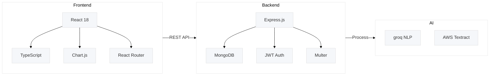

<div align="center">
  
  <h1>💸 Cost-Sage-Analysis</h1>
  <p>AI-Powered Expense Management with Smart Document Insights</p>
  <p><strong>🚀 This project is built for the Hackathon conducted by <span style="color:#4a6fa5">HACKHAZARDS</span></strong></p>
  <p><em>🙏 Special thanks to <strong>HACKHAZARDS</strong> for providing us the platform to showcase our skills!</em></p>
  
  <div>
    
    
    
    
  </div>
</div>

---

## ✨ Features

### 📄 AI Document Processing
- 🧾 Receipt/statement parsing (PDF/IMG/CSV)
- 🔍 Auto-extract amounts, dates, merchants
- 🧠 Smart expense categorization
- 📁 Multi-file batch processing

### 💬 Smart Chat Assistant
- 🗣️ Natural language queries
- 💡 "Show my top spending categories"
- 🍽️ "Find all business meals > $50"
- 📊 Predictive budget insights

### 📊 Advanced Analytics
- 📈 Interactive spending charts
- 📑 Custom report generation
- 📉 Budget forecasting
- 💱 Multi-currency support

---

## 🛠 Tech Stack



---

## 🚀 Quick Start

### Prerequisites

- Node.js ≥ 18.x
- MongoDB Atlas account
- groq API key

### Installation

```bash
# 1. Clone repo
git clone https://github.com/yourusername/cost-sage-analysis-pro.git
cd cost-sage-analysis-pro

# 2. Install dependencies
npm install

# 3. Configure environment
echo "MONGODB_URI=your_mongo_connection_string" >> .env
echo "groq_API_KEY=your_groq_key" >> .env

# 4. Start application
npm run dev
```

---

## 📁 Project Structure

```
costsage-pro/
├── client/                 # Frontend
│   ├── public/             # Static assets
│   └── src/
│       ├── ai/             # AI components
│       ├── api/            # API services
│       └── ...             # Other modules
│
└── server/                 # Backend
    ├── controllers/        # Business logic
    ├── routes/             # API endpoints
    └── ...                 # Configurations
```

---

## 📜 License

MIT License © 2024 Your Team

---

<div align="center">
  <h3>💡 Contributors Welcome!</h3>
  <p>
    <a href="#">
      
    </a>
    <a href="#">
      
    </a>
  </p>
</div>
